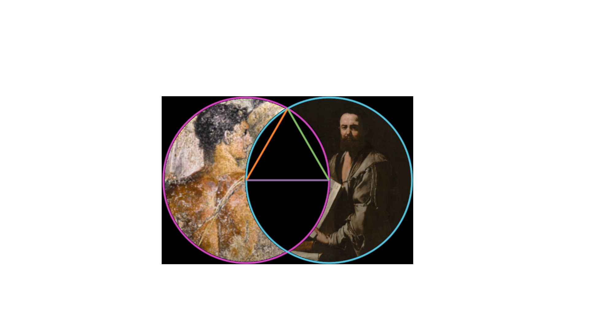

## Euclid's Elements Visualizations

Welcome to the repository for storing my random Euclid's elements visualizations.

As I have been working through the Greek text of book 1, I have been creating some nifty visuals to go along with them for pedagogical purposes.

